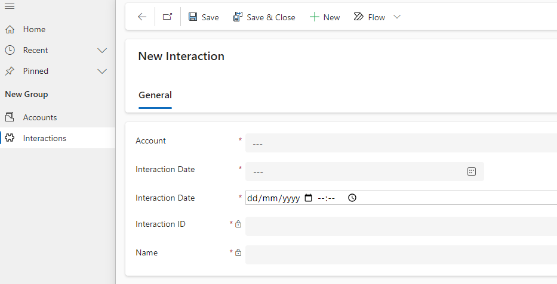

# Fixture Based Tests

Fixture based tests use an approach that encapsulates most of the testing functionality in based classes and delivers a "fixture" that can be used to express tests in a very high level way.

## Interactions entity

The main point of the Interactions entity is that is has a single date field that is exposed using both our "Specific Date Field" control and the out of the box CRM date time entity.



We use this form to test the behavious of the PCF control. Particular points are: -
- The impact of the user's locale on how dates are passed between the PCF control and the Model driven app framework.
- The effect of the user's CRM timezone setting. (This is not necessarily the same as the user's locale)

## [interaction-page.ts](./interaction-page.ts)

This class encapsulates logic for interacting with out test entity "Interactions"

## [interaction-fixture.ts](interaction-fixture.ts)

This is a class that effectively "wraps" our tests with setup and teardown logic. 
This is described in the Playwright documetnation [here](https://playwright.dev/docs/test-fixtures)

## [interaction-test.test.ts](./interaction-test.test.ts)

This contains our actual tests. Thanks to the use of the Interaction fixture we can compose these tests in a very high level manner. This allows us to test the interaction of our PCF control with the model driven framework using a very consise and easily understood syntax.

``` typescript
/**
 * Partly setting the specific date does not set the OOB date.
 */
test('Partial specific date not valid', async({interactionPage, page}) =>{
    await interactionPage.setSpecificDate("12042024", undefined);
    await interactionPage.assertOOBDate( undefined, undefined);
})
```

Note that we also use the playwright framework to test our application in several different locales. 
We also test the effect of daylight saving time using dates that are before/after DST changeover.

What this test does not do is to validate the effect of the CRM time zone setting on the PCF control (this is entirely separate to the user's browser Locale setting).

To automate this test we would need to have several test accounts set up with different CRM time zone settings.
A different approach might be to try to set the CRM time zone setting in the fixture, but this would make the tests slower, and is likely to introduce additional "flakiness" into the tests.

We can however validate the current approach by setting our test account with different timezone settings and running the test suite.

In a CI/CD environment we could potentially structure our tests to set the CRM timezone, run the test suite, change the test account time zone, then repeat.